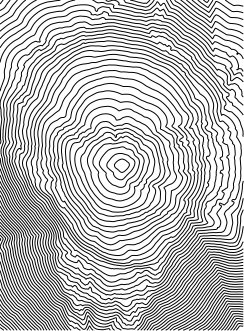
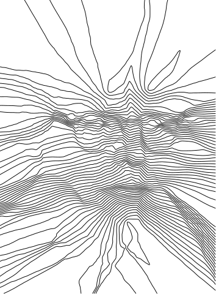
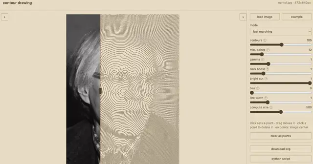

# Contour Drawing

Generates geodesic contour lines from an image: a fast marching method solves
the Eikonal equation from one or more source points, travelling fast through
bright image regions and slowly through dark ones. The isolines of the
resulting distance map form a contour drawing well suited for pen plotters.



The same portrait in difference mode: contours of the difference between the
distance maps of two source-point sets.



Example image: [Andy Warhol, 1975](https://commons.wikimedia.org/wiki/File:Andy_Warhol1975.jpg), public domain, Wikimedia Commons.

## Web app



The app runs entirely in the browser, with no server and no dependencies:
**[tlausz.github.io/contour-drawing](https://tlausz.github.io/contour-drawing/)** —
or simply open `index.html` locally. The Warhol portrait is embedded in the
file and preloaded as a demo image on startup.

- Load your own image via drag & drop or "load image"; "example" reloads the
  Warhol portrait
- Two drawing modes: fast marching (geodesic contours, as in the CLI) and
  difference (interference pattern between two source-point sets, points
  alternate between the sets)
- Click on the image to set a source point, drag to move it, click a point to
  delete it. Without points the computation starts at the image center
- Sliders for contour count, gamma, dark boost, bright cut, blur, line width
  and compute size; every change recomputes automatically
- A draggable divider over the preview compares both sides: left the
  preprocessed source (blur, gamma, dark boost and bright cut are visible
  there), right the contour result
- A mask panel (tab on the left) clips the lines to a shape: ellipse,
  rectangle (both movable, resizable, rotatable) or a lasso polygon, with an
  invert switch. The lines are trimmed geometrically, so the downloaded SVG
  contains only the cut paths
- "download svg" saves the result as plain black lines, "python script" the
  CLI original

## CLI (Python)

The original script computes at full resolution and offers the same
parameters:

```
pip install numpy scikit-image matplotlib
python3 contour-drawing.py input.jpg -o output.svg
```

The example above was generated with:

```
python3 contour-drawing.py example/warhol.jpg -o example/warhol.svg \
  --scale 0.5 --num 60 --dark-boost 1.8 --bright-cut 0.75 --blur 1.5 --min 12
```

| Parameter | Default | Effect |
|---|---|---|
| `--mode` | fmm | fmm: geodesic contours; diff: difference of two point sets |
| `--source x,y` | image center | source point, may be given multiple times; in diff mode points alternate between set A and set B |
| `--num` | 30 | number of contour levels |
| `--min` | 10 | minimum points per contour (filters noise) |
| `--gamma` | 1.0 | gamma correction |
| `--dark-boost` | 1.0 | above 1: more lines in dark regions |
| `--bright-cut` | 1.0 | below 1: fewer lines in bright regions |
| `--blur` | 0.0 | Gaussian blur sigma |
| `--scale` | 1.0 | input image scale factor |
| `--thickness` | 1.0 | line width |
| `--color` / `--bg` | black / white | line and background color |

The web app ports the same algorithm to JavaScript (fast marching with a
binary heap, contours via marching squares) and computes on a downscaled
version of the image to stay interactive. For full-resolution plotter output
the Python script is the better choice.
